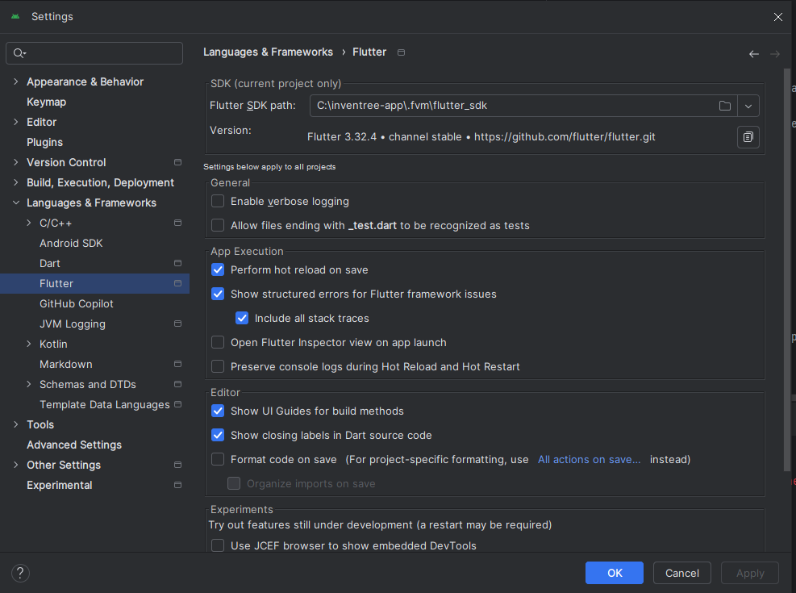

## InvenTree App Development

For developers looking to contribute to the project, we use Flutter for app development. The project has been tested in Android Studio (on both Windows and Mac) and also VSCode.

## Prerequisites

To build the app from source, you will need the following tools installed on your system:

- Android Studio or Visual Studio Code (with Flutter and Dart plugins)
- [Flutter Version Management (FVM)](https://fvm.app/) - We use FVM to manage Flutter versions

### iOS Development

For iOS development, you will need a Mac system with XCode installed.

### Java Version

Some versions of Android Studio ship with a built-in version of the Java JDK. However, the InvenTree app requires [JDK 17](https://www.oracle.com/java/technologies/javase/jdk17-archive-downloads.html) to be installed.

If you see any errors related to JDK version mismatch, download and install the correct version of the JDK (from the link above) and update your Android Studio settings to point to the correct JDK location:

```bash
fvm flutter config --jdk-dir /path/to/jdk
```

## Invoke Tasks

We use the [invoke](https://www.pyinvoke.org) to run some core tasks - you will need python and invoke installed on your local system.

## Flutter Version Management (FVM)

This project uses [Flutter Version Management (FVM)](https://fvm.app/) to ensure consistent Flutter versions across development environments and CI/CD pipelines.

For installation instructions, please refer to the [official FVM documentation](https://fvm.app/documentation/getting-started/installation).

Once installed, FVM will automatically use the Flutter version specified in the `.fvmrc` file at the root of the project.

### Visual Studio Code

To set up Visual Studio Code, you will need to make sure the `.vscode` directory exists. Then run `fvm use` to ensure the correct Flutter version is used.

```
mkdir -p .vscode
fvm use
```

#### What happens:
- Downloads SDK if not cached
- Creates `.fvm` directory with SDK symlink
- Updates `.fvmrc` configuration
- Configures IDE settings
- Runs `flutter pub get`


### Android Studio

To set up Android Studio, run `fvm use` to ensure the correct Flutter version is used.

```
fvm use
```

#### What happens:
- Downloads SDK if not cached
- Creates `.fvm` directory with SDK symlink
- Updates `.fvmrc` configuration
- Runs `flutter pub get`

Set Flutter SDK path in Android Studio:

1. Open Android Studio
2. Go to `File` -> `Settings` -> `Languages & Frameworks` -> `Flutter`
3. Set `Flutter SDK path` to `.fvm/flutter_sdk`:




## Getting Started

Initial project setup (after you have installed all required dev tools) is as follows:

Generate initial translation files:

```
invoke translate
```

Install required flutter packages:
```
fvm flutter pub get
```

You should now be ready to debug on a connected or emulated device!

## Troubleshooting

### Flutter Doctor

If you're experiencing issues with the development environment, run Flutter Doctor to diagnose problems:

```bash
fvm flutter doctor -v
```

This will check your Flutter installation and identify any issues with your setup. Common issues include:

- Missing Android SDK components
- iOS development tools not properly configured
- Missing dependencies

Fix any identified issues before proceeding with development.


## Building Release Versions

Building release versions for target platforms (either android or iOS) is simplified using invoke:

### Android

Build Android release:

```
invoke android
```

### iOS

Build iOS release:

```
invoke ios
```
